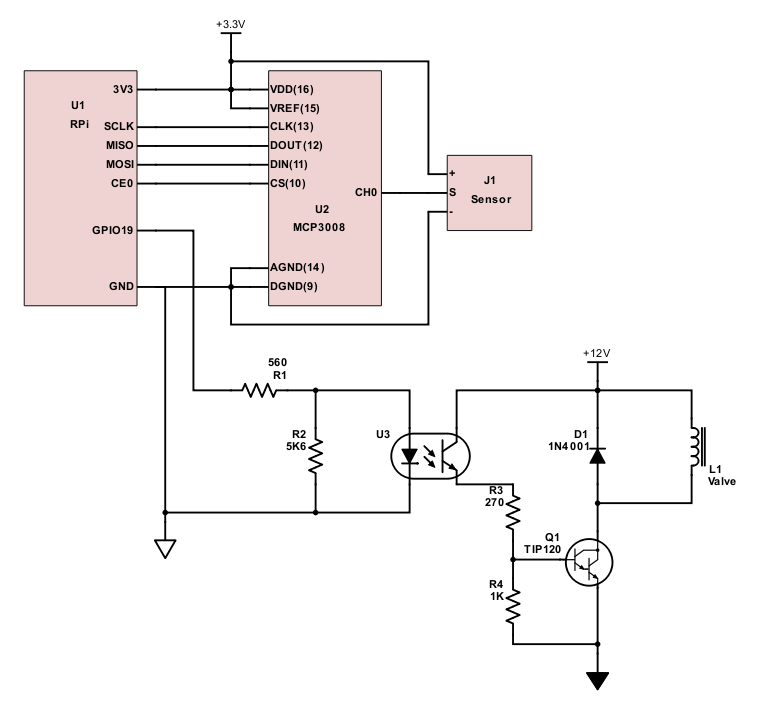

# Auto Watering System

A small, soil watering system that takes into account current soil conditions to keep the moisture level at suitable conditions for the plant in the pot.

## Feature Set

* Soil Moisture Monitoring
* Automatic hydration control
* Telemetry Recording
* Remote Access

## Detail Operation

1. Unbox the device.
1. Plug the device into a power source. (Battery operation in other model)
1. Insert the soil moisture prong into the soil of the pot.
1. Access the application to set the moisture threshold considering the potted plant.
1. Fill the water tank with clean cool water.

## Design

### Parts List

* [Moisture Sensor](https://www.amazon.com/gp/product/B01N7NA3HP/ref=ox_sc_act_title_1?smid=A2O4FZXIRZDLHA&psc=1)
* [Water Solenoid](https://www.amazon.com/DIGITEN-Solenoid-Connect-normally-Closed/dp/B071JDFVNQ?th=1)
* [Plastic Tubing](https://www.amazon.com/cck-cck-2-Malida-Meters-Length/dp/B018UEMGZE/ref=pd_sim_328_5/136-9152389-5081925?_encoding=UTF8&pd_rd_i=B018UEMGZE&pd_rd_r=3d3b2491-47a6-11e9-b249-f166425d909c&pd_rd_w=xnLd3&pd_rd_wg=oLsMh&pf_rd_p=90485860-83e9-4fd9-b838-b28a9b7fda30&pf_rd_r=F0NCEP1XRW63KZ9ZPW2Y&psc=1&refRID=F0NCEP1XRW63KZ9ZPW2Y)
* [Tube Connectors](https://www.amazon.com/Neeshow-Quick-Connect-Water-Fitting/dp/B01LXEC9R3/ref=pd_bxgy_328_img_3/136-9152389-5081925?_encoding=UTF8&pd_rd_i=B01LXEC9R3&pd_rd_r=25efe5d8-47a7-11e9-97b0-73c3e6ce26b1&pd_rd_w=7JqSW&pd_rd_wg=AhvUI&pf_rd_p=a2006322-0bc0-4db9-a08e-d168c18ce6f0&pf_rd_r=0X02TS5GKRMAFYEKWMXT&psc=1&refRID=0X02TS5GKRMAFYEKWMXT)
* Water tank (2 liter bottle)
* Raspberry Pi MicroController
* [12V 1A Power Supply](https://www.amazon.com/SoulBay-Adapter-Replacement-Regulated-Certificate/dp/B07C75RT38/ref=sr_1_3?keywords=12V+DC+1000mA+%281A%29+regulated+switching+power+adapter&qid=1552711971&s=gateway&sr=8-3)
* [PC817 optocoupler](https://www.amazon.com/gp/product/B01GYH74O2/ref=ox_sc_act_title_1?smid=A34K5WF5Z9R33P&psc=1)
* [TIP120 Darlington Transistor](https://www.amazon.com/Pieces-TIP120-Power-Darlington-Transistors/dp/B00NAY1IBS/ref=sr_1_2?crid=ZO3Z8WPFHYXM&keywords=tip120+darlington+transistor&qid=1552715211&s=gateway&sprefix=tip120+%2Caps%2C193&sr=8-2)
* 1N4001 Diode
* 560 ohm resistor
* 5.6kohm resistor
* 270 ohm resistor
* 1k ohm resistor
* [MCP3008 Analog to Digital Converter](https://www.amazon.com/gp/product/B00NAY3RB2/ref=ox_sc_act_title_2?smid=A20VIERU7MNN7L&psc=1)

### Schematic



### Software Design

#### Monitoring and Control Process

Standalone process that periodically wakes up and:

1. Reads the data from the ADC (via SPI).
1. Record the current moisture value into the control database.
1. If water is current *OFF*, set the water on based upon value below **on threshold**.
1. If water is currently *ON*, set the water off based upon value above **off threshold**.
1. Record the water on/off setting in the control database.
1. Record all of the information and timestamp of reading into the history database.

* Testing the valve shows that the water flows pretty quickly, so the period at which this app must wake up is very short, maybe every 100ms.
* Testing the sensor shows that it reads 0 in dry air.
  * In water its reading around 500-600.
  * Against a damp sponge its reading 400's.
  * Using the tip of the sensor is different than the side of it.
  * Need more testing to get a feel for proper moisture thresholds.

##### Pseudocode

* Configure SPI interface.
* Connect to database.
* While forever:
  * Read the sensor channel 0 from SPI.
  * Append sensor reading to list.
  * Record sensor reading in database.
  * If water is off:
    * Compare list values to water on threshold.
    * If last 10 values are less than threshold:
      * Turn on water gpio.
      * Record water state in database.
      * Record transition time in history database.
  * If water is on:
    * Compare list values to water off threshold.
    * If last 3 values are greater than threshold:
      * Turn off water gpio.
      * Record water state in database.
      * Record transition time in history database.
  * Sleep for 100ms.

#### Web-based Interface

A simple [Flask](http://flask.pocoo.org/docs/1.0/) application that provides a method to visualize the current information and to control the configuration of the system, such as the water on and off thresholds.

#### Software Installation

1. Clone the repo from github (https://github.com/kaiserfro/auto-water.git).
1. `cd auto-water`
1. `virtualenv -p python3 .`
1. `./bin/python setup.py install`

#### Run Software

Start the web interface:

```sh
./run.sh
```

Start the monitor

```sh
./monitor.sh
```

## Future Enhancements

* Add capability to mix in fertilizer
* Get water down to roots, maybe make a vase that can water evenly.
* Waterproof electronics to make outdoor version
* Add a water tank monitor
* Cloud-enable
  * Keep metrics in cloud
  * Host web application in cloud
  * Accessible remotely
* Auto-configuration, wifi, etc.
* Handle multiple sensors, multiple valves to handle multiple plants with one system

## Resources

* https://darkbluebit.com/raspberry-pi/control-12v-devices/
* https://docs.anychart.com/Gauges/Circular_Gauge
* https://materializecss.com/
* https://tinydb.readthedocs.io/en/latest/index.html
* http://flask.pocoo.org/docs/1.0/
* https://pimylifeup.com/raspberry-pi-adc/
* https://learn.adafruit.com/raspberry-pi-analog-to-digital-converters/mcp3008

## TODO

* ~~Convert Data below the guage to cards~~
* Add button to turn water on/off immediately (request)
* Add form to adjust the thresholds
* Create module to control valve output (actual)
* Create module to monitor the moisture and report to database
* Add web page to show timestamped history
